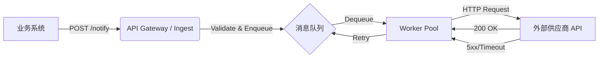

# API Notification System Design & Implementation

## 1. 对问题的理解

本系统是一个**通用的 HTTP 异步通知网关**。
其核心职责是将内部业务系统（上游）产生的事件通知，可靠地投递到外部第三方系统（下游）。

**核心特征：**
*   **异步性**：上游业务系统不需要等待下游的响应，只需确认“通知请求已被系统接收”。
*   **可靠性**：系统必须保证通知最终能够送达（即使下游暂时不可用）。
*   **多样性**：支持不同的 Target URL、Headers 和 Body 格式。


## 2. 整体架构与核心设计

### 2.1 架构图 (MVP)



### 2.2 核心组件

1.  **Ingest Service (接收端)**:
    *   提供 HTTP 接口接收通知请求。
    *   进行基本的参数校验（URL 是否合法，Body 是否为空）。
    *   将请求封装为 Task，持久化到消息队列。
    *   快速返回 `202 Accepted` 给上游。

2.  **Message Queue (中间件)**:
    *   **MVP 实现**: 使用Redis List简单实现队列功能。生产环境可以使用kafka\rocketmq等消息队列。

3.  **Dispatcher & Worker (投递端)**:
    *   消费者从队列中拉取任务。
    *   执行 HTTP 请求。
    *   根据响应状态码决定是“标记成功”还是“触发重试”。

## 3. 关键工程决策与取舍说明

### 3.1 系统边界

**Q: 哪些问题在这个系统中解决？**
*   **可靠投递**: 接受请求后，系统必须确保将通知送达下游。同时系统应该异步处理，不阻塞上游业务流程。
*   **流量削峰**: 通过队列缓冲，防止内部业务突发流量压垮外部供应商的 API。
*   **重试机制**: 自动处理网络抖动和下游临时宕机。

**Q: 哪些问题明确选择不解决？**
*   **Payload 转换**: 系统不负责将业务数据（如 OrderID）转换为供应商需要的 XML/JSON 格式。上游必须传递最终可用的 Request Body。
    *   *原因*: 保持系统的通用性和轻量级，避免耦合具体业务逻辑。对于后续迭代中，可以考虑将消息体的映射逻辑通过配置中心动态配置，并进行字段映射。

### 3.2 可靠性与失败处理

**Q: 通知投递语义是什么？**
*   选择 **At-Least-Once (至少一次)**。
*   *原因*: 对于通知下游业务系统的这种场景，下游系统提供的通知接口应该进行幂等先关保证。所以只需要保证消息at least once即可。

**Q: 外部系统失败或长期不可用的处理策略？**
1.  **指数退避重试 (Exponential Backoff)**:
    *   第一次失败等待 1s，第二次 2s，第三次 4s... 直至达到上限（如 1小时）。
    *   避免在下游宕机时发起“重试风暴”将其彻底打死。
    *   当前实现中，由于是使用redis list简单模拟队列的情况，所以指数退避策略由AI编码实现，实现逻辑比较粗糙，目前实现中可能出现的问题是系统一旦宕机重启会导致正在退避中的数据丢失。对于这种情况可以通过将redis list替换为可靠的消息中间件来实现。
2.  **最大重试次数**:
    *   设定上限（如 10 次）。
3.  **死信队列 (Dead Letter Queue, DLQ)**:
    *   超过最大重试次数仍失败的任务，移入 DLQ。
    *   DLQ 中的消息需要人工介入处理，或由专门的脚本进行二次分析/告警。
4.  **超时控制**:
    *   对外部 API 调用设置严格的 Timeout (如 5秒)，防止 Worker 线程被长时间阻塞。

---

## 4. MVP 实现说明

本代码仓库包含一个最小可行性实现 (MVP)：

*   **语言**: Go (Golang)
*   **依赖**: 标准库 + (可选) SQLite/Redis 驱动。为简化运行，默认使用 **内存队列 (Buffered Channel)** 模拟 MQ。
*   **目录结构**:
    *   `main.go`: 程序入口与 HTTP Server。
    *   `internal/handler`: HTTP 请求处理逻辑（如 /notify）。
    *   `internal/model`: 数据模型定义。
    *   `internal/queue`: 队列接口定义与内存实现。
    *   `internal/worker`: 消费者与重试逻辑。
* **未来演进**:
    当未来流量显著增长时，首先应给替换消息中间件，比较常见的可以替换为kafka或者rocketmq，以下以使用kafka为例进行说明：
    *   在项目中根据当前的消息量级来合理设置kafka的partition数量，生产者可以并发的向不同的partition发送消息，而每个partition内部则是有序的。
    *   消费者可以并发的从不同的partition拉取消息，而每个partition内部的消息是有序的。
    

## 5. AI使用说明
由于在此项目上投入的精力有限，所以对于需求描述，先选择通过ai agent整体理解需求，并生成了第一版代码。在AI生成的第一版代码中，对于消息队列选择了本地channel来实现。
对于AI整体的代码实现，大部分选择了直接采用，只是对于消息队列的选择上选择了再次通过AI替换为简单的redis list来实现，更合理的实现应该是在这里使用更可靠的消息队列中间件。
同时，这个项目默认了一个大的工程前提：即内部的业务系统是通过http接口来触发通知事件的，并没有通过消息订阅的方式来进行。但是在更常见的工程实现场景，上游的内部系统应该通过消息订阅的方式来让其他下游感知系统变更事件，对于这种更常见的场景，在本系统内部仅需要实现上游特定消息的订阅和消息到http接口的转发即可。

### 运行方式
```bash
go run main.go
```
